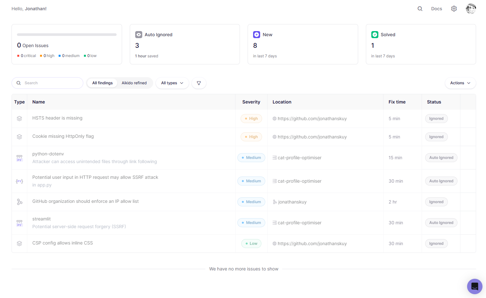

# Security

Security practices for Cat Profile Optimiser, covering secure coding, responsible data handling, dependency hygiene, and the Aikido scan report.

> This document maps to the hackathon's Security criterion (15%) and feeds Documentation (10%). Sections 1–4 reflect the project as built; §5 (Aikido results) is filled in after running the scan.

---

## 1. Responsible data handling

- **Dataset.** We use the [PetFinder.my Adoption Prediction](https://www.kaggle.com/competitions/petfinder-adoption-prediction) dataset, publicly available for the Kaggle competition, for model training only. Scope: cats only (`Type == 2`), single-cat listings, ~4,943 records.
- **No dataset in the repo.** Raw data is excluded via `.gitignore` (`data/`) and not committed or redistributed. Users download it themselves from Kaggle. Only the small breed/color/state label CSVs are needed at runtime (for dropdown display). The large `train.csv` and images are training-only.
- **No user input is persisted.** Cat attributes entered into the app are processed in-memory to produce a score and explanation; nothing is logged, stored, or written to disk. The app holds the current cat in Streamlit session state for the session only.
- **LLM calls (description-rewrite feature).** When a user requests a rewrite, the cat's supplied attributes and original description are sent to Google's Gemini API (via Google AI Studio). No personal data about the *user* is collected or sent (only the listing content they entered). Users of the free-tier API should note that Google may use free-tier API data to improve its products (per Google AI Studio's terms). No user-identifying information is included in requests, only cat listing details.
- **No photo upload implemented.** The photo-quality stretch feature was not built, so no images are uploaded, processed, or stored.

## 2. Secrets management

- **No secrets in the repo (verified).** `git ls-files` shows no `.env`, key, or credential files tracked. The only secret the project uses is the Gemini API key, read from an environment variable in `app.py`'s AI features — never committed.
- **Local development:** the Gemini API key is read from the `GEMINI_API_KEY` environment variable via `os.getenv`, set in the terminal before running — never hardcoded, never written to a file in the repo.
- **Production (Streamlit Cloud):** the key is stored in the Streamlit Secrets manager, not in code.
- **`.gitignore` covers** `.env`, `.streamlit/secrets.toml`, and `data/` — so no key, secrets file, or dataset can be committed accidentally.
- **The app's own code (preprocessing, model, explainability) uses no secrets**, only the LLM feature does. This keeps the secret surface to a single, well-contained module.
- If a key is ever committed by accident, it is **rotated immediately**, not just removed from the latest commit (it persists in git history otherwise).

## 3. Secure coding practices

- **Input validation.** All form inputs are constrained at the UI: numeric fields have bounded ranges (age, fee, photo count can't be negative or absurd), and categorical fields (breed, color, health/vaccination status) are dropdowns limited to known valid options. Users can't submit arbitrary or malformed values into the model. The preprocessing layer additionally maps any out-of-range category to a safe "missing" value rather than erroring.
- **No code execution from input.** No `eval`, `exec`, or execution of user-supplied data. The model artifact loaded from `models/` (via joblib) is one we produced ourselves, not user-supplied.
- **Graceful failure.** The partner modules (recommendations, LLM rewrite) are wrapped so that if one is absent or errors (including an LLM API failure) the rest of the app (score, explanation, what-if re-score) still renders. Failures degrade to a caption, not a crash.
- **Least information in errors.** User-facing error messages show only the error type, not internal paths, keys, or full tracebacks.

## 4. Dependency hygiene

- **Pinned versions.** `requirements.txt` pins every package to a specific version, so builds are reproducible and known-vulnerable versions can't silently slip in.
- **Lean, hand-written list.** Dependencies are limited to what the project actually uses (~a dozen packages), rather than an exported environment dump. A smaller surface means fewer things to scan and fewer potential vulnerabilities.
- **Runtime vs. tooling separation.** Training/experiment tooling (MLflow, plotting libraries) is kept distinct from the app's runtime dependencies, so the deployed app carries the minimum needed to run.
- **Vulnerability scanning** via Aikido (below).

## 5. Aikido security scan

The repository was connected to [Aikido](https://www.aikido.dev/) and scanned (SAST, dependency/SCA, and secrets detection).

**||IMPORTANT|| Scope.** Connecting a GitHub account lets Aikido scan two different surfaces: (a) this project's code and dependencies (`cat-profile-optimiser`), and (b) the broader GitHub *account/domain* surface (profile web headers, org settings). Only surface (a) is in scope for this project. Account-surface findings are noted below but are not part of the cat-application deliverable.

**Scan summary (project scope):**

| Metric | Result |
|---|---|
| Critical findings | 0 |
| High findings | 0 |
| Secrets detected | 0 |
| Medium findings (project code) | 2 - fixed/reviewed (see below) |
| Dependency advisories | 2 - reviewed, auto-ignored as non-applicable |

### Project-code findings & resolutions

1. **`preprocess.py` | potential file-inclusion via file write (Medium, SAST).**
   Aikido flagged `save_schema()`'s file write: a user-controlled `path` could in theory write outside the intended location.
   *Resolution:* **Fixed, with the residual static-analysis flag reviewed and accepted.** `save_schema()` now resolves the target path and rejects anything outside the project root before writing (verified that legitimate paths work and a traversal attempt (`../../../tmp/evil.json`) is rejected with a clear error). The static analyzer continues to flag the write because it pattern-matches the `write_text(variable)` shape and cannot trace that the variable is validated first; this residual flag was therefore reviewed and marked accepted in Aikido, with the justification that the path is validated against the project root and the write target is never user-supplied. In practice the function is only called during training with a hardcoded path. (Commit: "Harden save_schema against path traversal (Aikido finding)".)

2. **`python-dotenv` | path traversal via symbolic links (Medium, dependency advisory).**
   *Resolution:* **Reviewed, accepted.** Auto-ignored by Aikido. python-dotenv is a low-risk utility dependency; the app reads its API key directly from an environment variable and does not use dotenv to load untrusted paths, so the advisory isn't exploitable in our usage.

3. **`streamlit` | potential SSRF (Medium, dependency advisory).**
   *Resolution:* **Reviewed, accepted.** Auto-ignored by Aikido. The app makes no server-side requests to user-controlled URLs, so the advisory doesn't apply to how Streamlit is used here.

4. **`app.py` — potential SSRF in the Gemini API call (Medium, SAST).**
   Aikido flagged the outbound HTTP request in `call_gemini_api()`, where the request URL is built from a variable.
   *Resolution:* **Reviewed, accepted.** The request URL is the hardcoded Google Gemini API endpoint (or an operator-set `GEMINI_API_URL` environment variable) — it is never derived from user input, so there is no user-controlled path to the request and SSRF is not exploitable. Marked accepted in Aikido with this justification.

### Account-surface findings (out of scope for this project)

The scan also surfaced findings on the connected GitHub account's web/domain surface, not the cat application's code or deployment. These are noted for completeness but are not part of this deliverable:

- *HSTS header missing* (High) | GitHub-associated web surface, not this app.
- *Cookie missing HttpOnly flag* (High) | platform-level cookie, not set by this app.
- *GitHub org should enforce an IP allow list* (Medium) | a GitHub account setting, unrelated to the project.
- *CSP allows inline CSS* (Low) | web-header best-practice note on the account surface.

These concern GitHub's platform surface and account configuration rather than the cat application, so they are out of scope. The app itself is deployed on Streamlit Cloud, whose platform manages HTTP headers and cookies.

**Evidence:** 

---

## Summary

Cat Profile Optimiser uses a public dataset for training only, persists no user input (cat details live in session state for the session and are never stored), and keeps its single secret, the Gemini API key, out of the repo (read from an environment variable and never hardcoded), verified with `git ls-files`. Dependencies are pinned and hand-picked to a minimal set. An Aikido scan found **no critical or high issues and no secrets** in the project code. The one project-code finding (a theoretical path-traversal in `save_schema`) was **fixed with a verified path-validation guard** (the residual static-analysis flag was reviewed and accepted, since the scanner can't trace the runtime guard) two dependency advisories were reviewed and accepted as non-applicable, and the remaining scanner output concerned the GitHub account's web surface rather than the application and is out of scope.